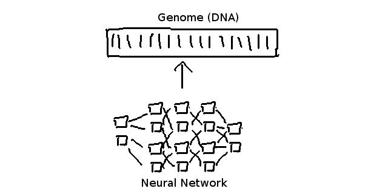

## Neural Network Genome



When applying genetic programming to our scenarios with
neural networks, the genes and genomes represent our
internal structure of our neural network, which means that
it will contain the following information:

- Layer connections (in a convolutional layer scenario)
- Neuron connections
- Neuron weights

However, to keep things simple we currently assume that our
neural network simply only has every neuron connected to its
previous layers, so we assume the Feed-Forward Network
structure for the sake of easiness.


**Serialization**

When talking about the identical reproduction of states of
instances (or composites), we talk about serialization and
deserialization in the programming world.

Assuming our latest code from the previous chapter, our
`Brain` will now get a `serialize()` method that pushes all
neuron weights into an array and returns it:

```javascript
Brain.prototype.serialize = function() {

	let weights = [];

	this.layers.forEach(layer => {

		layer.forEach(neuron => {
			weights.push(neuron.value);
		});

	});

	return weights;

};
```

**Deserialization**

The deserialization part will assume that we have a
simulation running with identical neural networks. For now
this is just easier to implement.

```javascript
Brain.prototype.deserialize = function(weights) {

	let index = 0;

	this.layers.forEach(layer => {

		layer.forEach(neuron => {
			neuron.value = weights[index++];
		});

	});

};
```

As you might have guessed already, the weights array is in
our scenario identical to the genome that our evolutionary
algorithm will produce.

