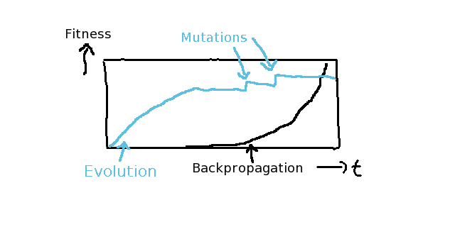
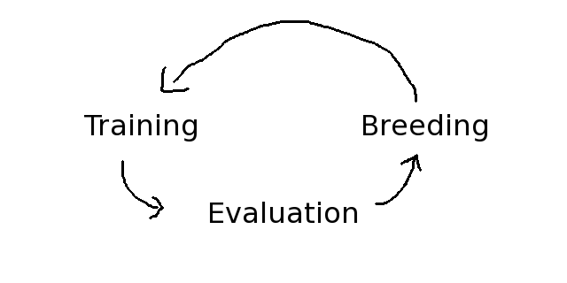

## Evolution

Evolution is the idea to use cross-breeding different models
or neural networks to leverage randomization to advance
those models. Those models in a simulation world are
so-called agents.

Agents reflect the implementation of a full-fledged actor
while they also have a brain, which is the implementation of
its neural network.

This means that an evolutionary algorithm can only advance
through randomization and parallelization. When there's no
competition, there's no progress of an evolutionary
simulation.

This is different from traditional single-Agent
reinforcement scenarios, as those try to advance a single
Agent. When comparing the advances of an evolutionary
algorithm with the advances of a backpropagated algorithm,
the evolutionary algorithm will always have "steps" in
improvement when randomization (or combination of
randomizations) were able to get a bit closer to the optimum
values.




**Evolution Cycles**

A basic evolutionary algorithm always has three different
cycles: Training, Evaluation, Breeding. Those cycles can run
unsupervised and can run infinitely.



The measurement of those advancements through genetic
recombinations is called a fitness function.

A fitness function typically measures the relative progress
of an Agent in a multi-agent simulation world. For example,
in a jump n' run game that would be the distance to the goal
or the amount of points the player has made through jumping
on its enemies.

When an Agent is making more progress than the other
competitors of the simulation, it is called a "fitter" or
more dominant Agent. More dominant in the sense that fitter
agents are more likely to breed than recessive ("unfitter")
agents.


**Evolution Population**

A healthy population of an evolutionary simulation consists
of different types of agents or better said, different ways
of how agents are "created".

1. The Survivor Population (~ `20%`) which keeps the fittest
   agents alive. If an Agent was better than the rest of the
   current population, it will survive up until the survivor
   population is filled.

2. The Mutant Population (~ `20%`) which is totally randomized
   to give randomization always a chance to make progress.
   In most implementations, Agent instances are randomized
   by default, so this is basically the part of the
   population with "newly created" agents.

3. The Breed Population (~ `60%`) which is created using the
   so-called crossover algorithm. This will combine the DNA
   of the fittest agents and combine it with other fit
   agents accordingly. In the genetic programming sense,
   this is how our neural networks can combine their
   knowledge.


**Crossover Algorithm**

Each Agent in the evolutionary simulation reuses the `Brain`'s
`serialize()` and `deserialize(weights)` method in order to
combine the mother's DNA with the father's DNA.

By default all `crossover(partner)` calls will result in two
different babies, one with the dominant characteristics of
the mother, and one with the dominant characteristics of the
father.

Additionally a typical evolutionary algorithm will also give
the chance of babies to mutate by a slight degree. Typical
values are e.g. a `10% Mutation Rate` and `25% Mutation Range`
but that highly depends if the given problem is changing over
time or not.

This allows the evolutionary algorithm to get adaptive to a
changing problem over time.

As discussed earlier in the *Genetic Programming* chapter,
the easiest way to recombine those weights is by using a
simple random split.

```javascript
Agent.prototype.crossover = function(father) {

	let mother = this;
	let babies = [ new Agent(), new Agent() ];
	let brain0 = [];
	let brain1 = [];

	let genome_mother = this.brain.serialize();
	let genome_father = father.brain.serialize();
	let dnasplit      = (Math.random() * genome_mother.length) | 0;


	for (let d = 0, dl = genome_mother.length; d < dl; d++) {

		if (w < dnasplit) {
			brain0[d] = genome_mother[d];
			brain1[d] = genome_father[d];
		} else {
			brain0[d] = genome_father[d];
			brain1[d] = genome_mother[d];
		}


		// Additional Mutation Chance
		// - 10% Mutation Rate
		// - 25% Mutation Range
		if (Math.random() <= 0.10) {
			brain0[w] += (Math.random() * 0.25 * 2) - 0.25;
			brain1[w] += (Math.random() * 0.25 * 2) - 0.25;
		}

	}


	babies[0].brain.deserialize(brain0);
	babies[1].brain.deserialize(brain1);


	return babies;

};
```

More advanced algorithms like NEAT will try to optimize the
random search space by remembering previously tried
combinations (recessive gene history) and try to optimize
the way different agents are able to cross-breed in order to
prevent unnecessary combinations (dominant species pooling).

However, pretty much all evolutionary algorithms follow the
same underlying basics. Evolution itself is a very powerful
tool to advance neural networks when you have no idea where
to start.

Always remember: Randomization will always solve your
problem, but you will have probably died already when it
happens; so optimizing random search space is what all
evolutionary concepts try to achieve as their first
priority.

Those optimizations can be achieve either through savings in
computation time (e.g. recessive gene history or dominant
species tracking) or by huge parallelization of simulations.

The huge advantage evolution has - compared to reinforcement
learning approaches - is that it can be parallelized and
take advantage of multiple networked computer systems.

